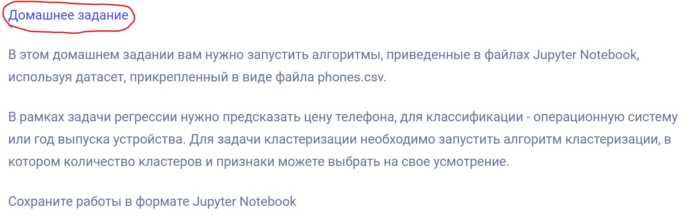
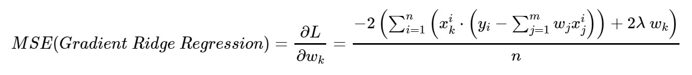

# Data Scientist. ML. Начальный уровень
## Дополнительные материалы
* Статья с подробным разбором градиентного спуска и регуляризации - [A Complete Tutorial on Ridge and Lasso Regression in Python](https://www.analyticsvidhya.com/blog/2016/01/ridge-lasso-regression-python-complete-tutorial/) в т.ч. разбирается математическая основа. Нужна для прохождения "Модуля 4 - Регрессия. Часть 2."  
  
## Module 1. Основные концепции Machine Learning 
* Где домашнее задание?  
  
<details>
<summary>Многие его не замечают:</summary>

</details>  

## Module 4. Регрессия. Часть 2  
### Задание высокого уровня
* В последнем задание как мне кажется есть опечатка скобки не совсем правильно поставлены, суммирование не нужно применять к части которая ответственна за регуляризацию. Я применял следующую функцию:  
  
  
* Более подробно про то как работает градиент и регуляризацию есть в статье - [A Complete Tutorial on Ridge and Lasso Regression in Python](https://www.analyticsvidhya.com/blog/2016/01/ridge-lasso-regression-python-complete-tutorial/)


## Module 5. Классификация. Часть 1
### Проблемы
Может возникнуть проблема с [graphviz](https://ru.wikipedia.org/wiki/Graphviz). Это целый пакет утилит для визуализации графов. При работе через Anaconda можно использовать следующее решение:
* Первая команда установить пакет утилит, из основного репозитория.
* Вторая команда установить обёртку вокруг них, чтобы можно было работать из python
```bash
        conda install -c anaconda graphviz
        conda install -c conda-forge python-graphviz
```
* Альтернативным вариантом может быть использование [Google Colab](https://colab.research.google.com/)
  * ❔Если у кого-то работает, подтвердите
* Альтернативным вариантом может быть решение Михаила:
  * Поставить утилиты с офицального сайта [graphviz](https://graphviz.org/)
  * И после прописать путь в `PATH` к папке, где лежат утилиты.
  * Или прописать `PATH` в блокноте Юпитера (Только вместо D:/Program Files (x86)/Graphviz2.38/bin/ указать ваш путь)  
```python
        import os
        os.environ["PATH"] += os.pathsep + 'D:/Program Files (x86)/Graphviz2.38/bin/'
```
  * ❔Если у кого-то работает, подтвердите

### Задание 3 - часть 4
В задании, где нужно указать `max_features=2`, также нужно указать `random_state=17`. Указывать данный параметр нужно в двух местах:
<details>
<summary>Указывать данный параметр нужно в <b>двух</b> местах, можете подумать сами где или заглянуть в спойлер:</summary>
<ul>
<li>`train_test_split(wine_dataframe_x, wine_dataframe_y, random_state=17)` - фиксируется разбиение датасета.</li>
<li>`DecisionTreeClassifier(random_state=17)` - фиксируется процесс обучения модели определённым образом</li>
<li>Результат обучения модели без `max_features=2` - 0.91</li>
<li>Результат обучения модели с `max_features=2` - 0.95</li>
</ul>
</details>  
