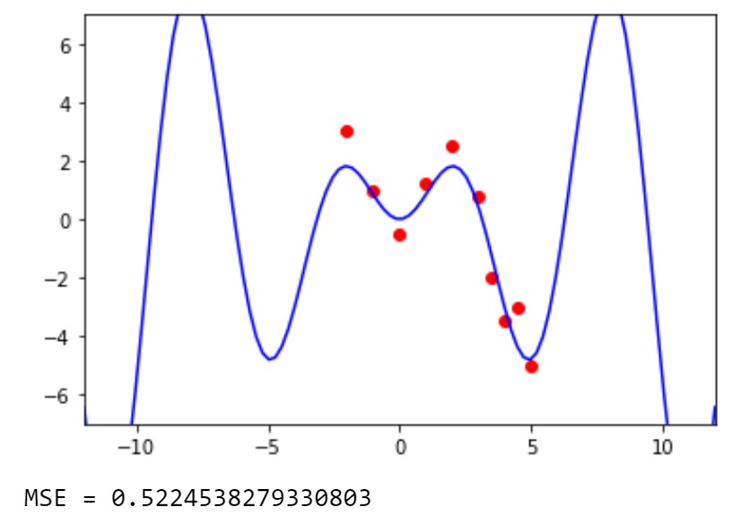

# Data Scientist. Основы математики для Data Science

## Полезные материалы
* [Производная функции, заданной неявно.
Производная параметрически заданной функции](http://mathprofi.ru/proizvodnye_neyavnoi_parametricheskoi_funkcii.html)  
  

## ML.7 Функции нескольких переменных, их свойства и графики
### Задание 1. Получите значение MSE меньшее 0.75
* Никак не получается:
  * `Хочется применить производную` - нет нужно подбирать руками.
  * `Что же делать?` - попробуй разобрать функцию на части и посмотреть какая часть за что отвечает на графике и после уже двигать.
    * f1 = -f1 - перевернуть график - отразить вертикально
    * f1 = f1 - 2  -  Сдвиг графика вниз - перемещение по оси OY
    * f1 = f1 + 2  - Сдвиг графика вверх - перемещение по оси OY
    * f1 = f1.subs(x, x + 5)  - Сдвиг графика влево - перемещение по оси OX
    * f1 = f1.subs(x, x - 5)  - Сдвиг графика вправо - перемещение по оси OX
    * f1 = f1.subs(x, x * 2)  - "Увеличить частоту\амплитуту" - чаще пересекает OX - сжимает ширину по OX - как пружина
    * f1 = f1.subs(x, x / 2)  - "Снижает частоту\амплитуту" - реже пересекает OX - растягивает в ширину по OX - как пружина
    * f1 = f1 * 1 - "Тянет" по вертикали от оси OX - "за вершины" вверх и вниз - растягивает 
    * f1 = f1 / 1 - "Приплющивает" по вертикали к оси OX - как пресс.
  * `Не помогло` - тогда см. доп.подсказку ниже.  
  

Как должен выглядеть график функции:

  
  